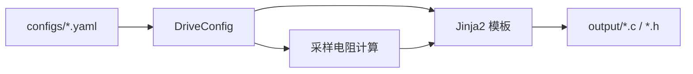

# 架构说明

## 目标

为电机驱动器（变频器/伺服驱动）提供**参数驱动**的嵌入式 C 代码生成，减少重复手写 HAL 胶水代码与采样参数换算。

## 数据流

## 扩展方式

1. 在 `templates/` 增加 `.j2` 模板
2. 在 `generator.render_all()` 注册输出文件名
3. 在 YAML 中增加字段，通过 `cfg` 上下文传入模板

## 后续规划

- FOC 电流环 PI 参数模板
- 与 STM32 CubeMX 生成代码的对接说明
- Modbus/ CAN 参数表导出
